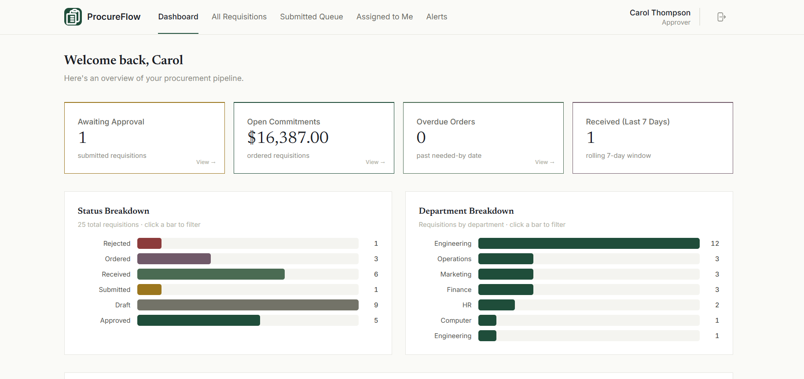
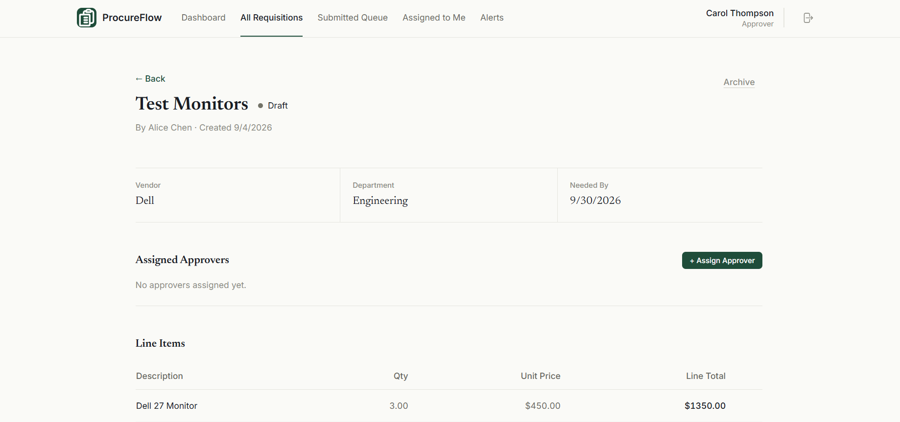
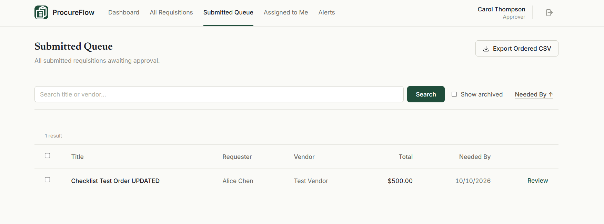

# Purchase Requisition System (ProcureFlow)

A full-stack procurement application designed to handle the internal lifecycle of purchase requisitions—from drafting and submission to approval, ordering, and receiving. 

Built with strict role-based access controls, robust state machine logic, and a premium "ledger-themed" UI.

## Tech Stack
- **Backend:** Node.js, Express, TypeScript, PostgreSQL (via Prisma ORM)
- **Frontend:** React, Vite, TypeScript, TailwindCSS
- **Authentication:** JWT in HTTP-Only Cookies + bcrypt

## Features
- **Strict State Machine:** Draft ➔ Submitted ➔ Approved ➔ Ordered ➔ Received. Illegal transitions are blocked at the database level.
- **Role-Based Approvals:** Requesters create requests; Approvers review them based on strict dollar-amount limits.
- **Audit Timeline:** Every action (status changes, rejections, receiving shipments) is logged chronologically in a unified timeline.
- **Interactive Dashboards:** Clickable charts and metrics that pre-filter the main queues.
- **Bulk Actions:** Bulk approvals with per-item success/failure reporting.
- **Data Export:** Export ordered requisitions to CSV.

## Screenshots

### Dashboard


### Requisition Details & Timeline


### Queues & Filtering


## Local Development Setup

1. **Install Dependencies**
   ```bash
   npm install
   ```

2. **Database Setup**
   Ensure you have PostgreSQL running, then apply the schema and seed the database:
   ```bash
   cd server
   npx prisma migrate dev
   npx prisma db seed
   ```

3. **Environment Variables**
   - Create `server/.env` based on `server/.env.example`
   - Create `client/.env` based on `client/.env.example`

4. **Run the Servers**
   From the root of the project:
   ```bash
   # Terminal 1: Run the backend
   npm run server
   
   # Terminal 2: Run the frontend
   npm run client
   ```

## Documentation
- [Architecture & Stack](./docs/architecture.md)
- [Database Schema](./docs/schema.md)
- [Implementation Plan](./docs/plan.md)
- [Technical Decisions](./docs/decisions.md)
- [AI Prompts & Retrospective](./docs/ai-prompts.md)
